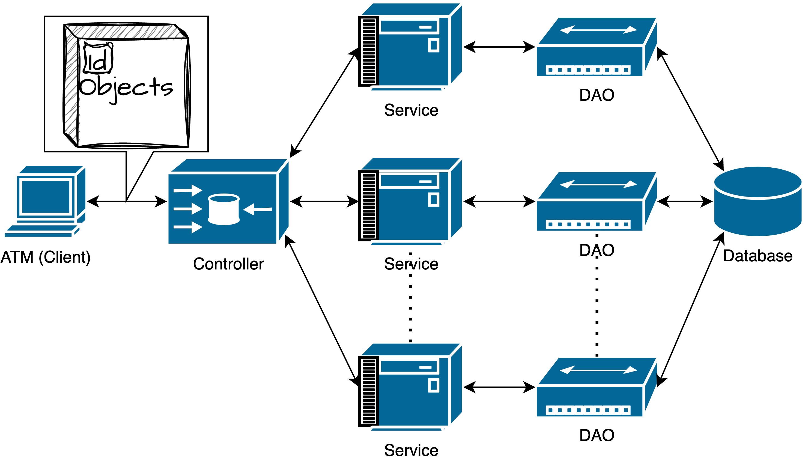

# MVC
This project is using a typical MVC structure. We divided it into several layers, which are GUI, Controller, Service and DAO. It is kind of like a SpringBoot project. The overall design is like the picture below.

## GUI

The GUI is the client for customers/managers to do the operations. 

## Controller

The Controller has all the functions that GUI needs to generate the objects or fetch the data. The Controller also holds the connection to the backend part.

| Method Name                                                  | Type                | Description                                                  |
| ------------------------------------------------------------ | ------------------- | ------------------------------------------------------------ |
| getAllStock()                                                | List\<Stock\>       |                                                              |
| loginCustomer(String username, String password)              | Customer            | If the username and password are correct, return the customer object, otherwise return null |
| registerCustomer(Customer customer)                          | Boolean             | If the customer is successfully registered, return true, otherwise return false |
| refreshAccount(Account account)                              | Account             | This method will check the database and return the updated account object |
| deposit(Account account, Money money)                        | Boolean             | If the deposit is successful, return true, otherwise return false |
| withdraw(Account account, Money money)                       | Boolean             | If the withdraw is successful, return true, otherwise return false |
| transfer(Account fromAccount, Account toAccount, Money money) | Boolean             | If the transfer is successful, return true, otherwise return false |
| getAccountByAccountNumber(Integer accountNumber)             | Account             | This method will check the database and return the account object |
| getTransactionHistory(Account account)                       | List\<Transaction\> | Get Transaction History (This can be accessed by using the getTransactionHistory() in account object). However, this method still needs to be implemented when the transaction history needs to be updated |
| openAccount(Customer customer, Account account)              | Boolean             | If the account is successfully opened, return true, otherwise return false. The account type need to be specified when creating the account object |
| closeAccount(Customer customer, Account account)             | Boolean             | If the account is successfully closed, return true, otherwise return false |
| openStock(Customer customer, Account account, SecurityAccount securityAccount, double initAmount) | Boolean             | Open stock account, must indicate the saving and security account, and the initial money at least 1000.0. Initially, there will be no deals in the security account, set all to be zero |
| buyStock(SecurityAccount account, Account bankAccount, Stock stock, int unit) | Boolean             | Must indicate the money using which bankAccount              |
| sellStock(SecurityAccount securityAccount, Account bankAccount, BoughtStock boughtStock, int unit) | Boolean             | Must indicate the money goes to which bankAccount            |
| viewBoughtStock(SecurityAccount securityAccount)             | List\<BoughtStock\> | get bought stock                                             |
| getRealizedByAccountNumber(int accountNumber)                | double              |                                                              |
| getUnrealized(SecurityAccount securityAccount)               | double              |                                                              |
| requestLoan(Customer customer, Loan loan)                    | Boolean             | This method will add a new loan account to the customer. If the loan is successfully added, return true, otherwise return false |
| payLoanByCash(Loan account, Money money)                     | Boolean             | If the loan is successfully paid, return true, otherwise return false |
| payLoanByTransfer(Loan account, Account fromAccount, Money money) | Boolean             | If the loan is successfully paid, return true, otherwise return false |
| convertCurrency(Account account, String fromCurrency, String toCurrency, double amount) | Boolean             | If the currency is successfully converted, return true, otherwise return false |
| loginManager(String username, String password)               | Manager             | If the username and password are correct, return the manager object, otherwise return null |
| registerManager(Manager manager)                             | Boolean             |                                                              |
| getCustomerByUsername(String username)                       | Customer            |                                                              |
| getAllCustomer()                                             | List\<Customer\>    |                                                              |
| getTransactionByDate(String day)                             | List\<Transaction\> | day must be in the format of mm-dd-yyyy                      |
| addStock(String name, int price)                             | Boolean             |                                                              |
| deleteStock(int id)                                          | Boolean             |                                                              |
| getUnapprovedLoanList()                                      | List\<Loan\>        |                                                              |
| getLoansByCustomer(Customer customer)                        | List\<Loan\>        |                                                              |
| approveLoan(Loan loan)                                       | Boolean             |                                                              |
| setHasCollateral(Customer customer, boolean hasCollateral)   | Boolean             |                                                              |

## Service

 The Service contains all the required business logic and connects to the DAO (Data Access Object). We divide this layer into many different services based the data their functions work on.

- Account
  - AccountService
  - LoanService
  - SecurityService
- BoughtStockService
- MoneyService
- Person
  - ManagerService
  - CustomerService
- StockService
- TransactionService

## DAO

As the documentation of oracle said,

> Code that depends on specific features of data resources ties together business logic with data access logic. This makes it difficult to replace or modify an application's data resources.
>
> The Data Access Object (or DAO) pattern:
>
> - separates a data resource's client interface from its data access mechanisms
> - adapts a specific data resource's access API to a generic client interface
>
> The DAO pattern allows data access mechanisms to change independently of the code that uses the data.

Data Access Object classes are used to connect to the database, and also in charge of transferring data between objects and database rows. This layer successfully avoid the situation that Client access the database directly, and also maintains the stability of data storage.

## (Entity) Object Class

This decides the way that data is stored in the program. To guaranteen the data consistency and also avoid frequently I/O through database, we need to use objects rather than just use the String data from database. For more details in this part, please view `Design` doc in this folder.